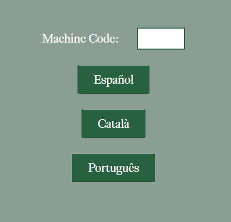
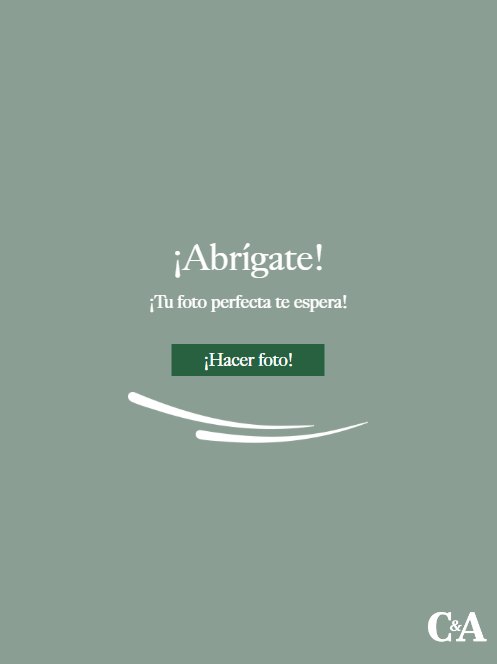
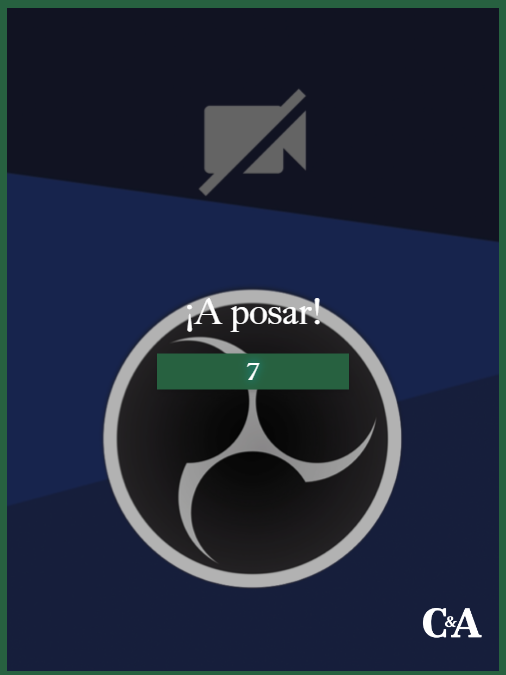

# Photo Puzzle Booth AI

A modern, interactive React-based photobooth application. This app allows users to select a background, snap a photo, and seamlessly merge themselves into their chosen scene using Google's GenAI (powered by Google's "nanobanana" magic!). To add to the fun, the resulting image is turned into an interactive puzzle game.

## Features

- **Multi-language Support**: Start the experience by selecting your preferred language.
- **Background Roulette**: Users can spin a roulette to select a fun, decorative background.
- **Integrated Camera Capture**: Built-in support for capturing user photos directly from the browser.
- **AI Image Generation**: Leverages Google's GenAI to intelligently insert the user into their chosen background.
- **Interactive Puzzle**: The newly generated photo is converted into a puzzle for a gamified experience.
- **Result & QR Sharing**: Users receive their final, branded image and can download it easily by scanning a generated QR code.
- **Inactivity Timer**: Automatically resets the app session to the start screen after a period of inactivity, perfect for kiosk environments.

## Tech Stack

- **Core**: React 18, Vite
- **AI Integration**: `@google/genai` (Google's GenAI API)
- **Utilities**: 
  - `qrcode` for generating downloadable image links
  - `uuid` for session tracking
  - `multer` / `node-machine-id` for backend/utility processing
- **Styling**: Custom CSS with responsive, dynamic UI elements

## Getting Started

### Prerequisites
Make sure you have [Node.js](https://nodejs.org/) installed on your machine.

### Installation

1. Navigate to the project directory:
   ```bash
   cd v02
   ```

2. Install the project dependencies:
   ```bash
   npm install
   ```

3. Set up environment variables for the Google GenAI API integration and Cloud Storage:
   - Copy the `.env.example` file to a new file named `.env`:
     ```bash
     cp .env.example .env
     ```
   - Open `.env` and replace the placeholder values with your actual API key and bucket name:
     ```env
     VITE_GEMINI_API_KEY=your_actual_api_key_here
     VITE_GCS_BUCKET_NAME=your_bucket_name_here
     ```
### Running Locally

To start the development server, run:
```bash
npm run dev
```
The app will be available at `http://localhost:5173/` by default.

### Building for Production

To create an optimized production build:
```bash
npm run build
```

To preview the built app:
```bash
npm run preview
```

## Application Flow

1. **Language Selection (`LanguageScreen`)**: The user chooses their language.
2. **Intro & Welcome (`IntroScreen`, `WelcomeScreen`)**: Brief instructions on how the photobooth works.
3. **Roulette (`RouletteScreen`)**: The user selects a background theme/decoration.
4. **Camera (`CameraScreen`)**: The user takes a photo of themselves.
5. **Processing**: The app uses Google's GenAI to merge the user's photo with the background prompt and appends a CYA logo.
6. **Puzzle Game (`PuzzleScreen`)**: The user must complete a sliding puzzle of their generated image.
7. **Result (`ResultScreen`)**: Displays the final image, puzzle outcome, and a QR code to download the photo.

## Folder Structure
- `src/components/`: Individual React components for each step of the photobooth flow.
- `src/services/`: API handlers, including `geminiService.js` for interacting with the AI.
- `src/hooks/`: Custom React hooks (e.g., `useInactivityTimer.js`).
- `src/images/` & `src/assets/`: Static image assets and logos.
- `src/constants.js`: Application constants, game states, and localized string definitions.
- `src/utils.js`: Helper functions such as adding the logo to the final canvas.

## Screenshots







